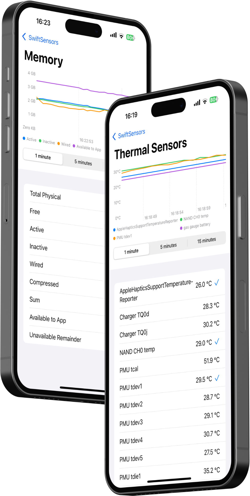

# SwiftSensors

[](https://swift.org/platforms/)
[](https://swift.org)
<a href="https://notebooklm.google.com/notebook/5851ef05-463e-4d30-bd9b-01f7668e8f8f/audio"></a>
<a href="https://docsend.com/view/x87pcxrnqutb9k2q"></a>
<a href="mailto:dima@getmirai.co,Alexey@getmirai.co?subject=Interested%20in%20Mirai"></a>

A Swift package for accessing real device sensor readings, including thermal, voltage, current, memory, CPU, and disk statistics.

<p align="left">
    
</p>

## Features

- Access thermal, voltage, current sensors readings
- Memory usage statistics
- CPU usage statistics
- Disk space information
- System information
- Battery information
- Formatted output for human-readable display

## Installation

### Swift Package Manager

Add the following to your `Package.swift` file:

```swift
dependencies: [
    .package(url: "https://github.com/getmirai/swift-sensors.git", from: "0.0.1")
]
```

## Usage

```swift
import SwiftSensors

// Get an instance of the sensor manager
let sensors = SwiftSensors.shared

// Get thermal sensor readings
let thermalReadings = await sensors.getThermalSensorReadings()
for reading in thermalReadings {
    print("\(reading.name): \(SensorFormatter.shared.formatTemperature(reading.temperature))")
}

// Get voltage sensor readings
let voltageReadings = await sensors.getVoltageSensorReadings()
for reading in voltageReadings {
    print("\(reading.name): \(reading.voltage)V")
}

// Get current sensor readings
let currentReadings = await sensors.getCurrentSensorReadings()
for reading in currentReadings {
    print("\(reading.name): \(reading.current)A")
}

// Get memory statistics
let memoryStats = await sensors.getMemoryStats()
print("Memory Usage: \(await sensors.getFormattedMemoryUsage())")

// Get CPU statistics
let cpuStats = await sensors.getCPUStats()
print("CPU Usage: \(await sensors.getFormattedCPUUsage())")

// Get disk statistics
let diskStats = await sensors.getDiskStats()
print("Disk Usage: \(await sensors.getFormattedDiskUsage())")

// Get thermal state
let thermalState = await sensors.getThermalState()
print("Thermal State: \(thermalState.rawValue)")

// Get system uptime
print("System Uptime: \(await sensors.getFormattedUptime())")
```

## Note on Private APIs

This package uses private APIs to access internal device sensors including thermal, voltage, and current readings. While this works well for development and diagnostic purposes, be aware that using private APIs may not be acceptable for App Store submissions.

## License

This project is available under the MIT license. See the [LICENSE](LICENSE) file for more info.
